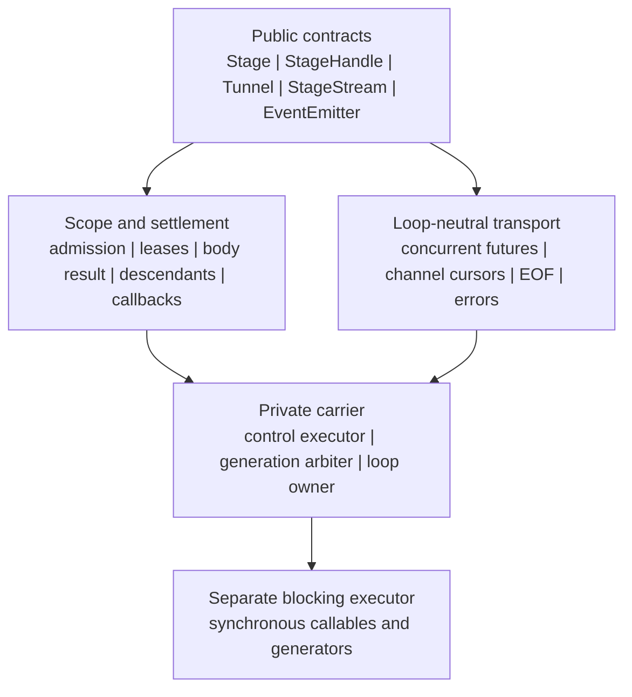
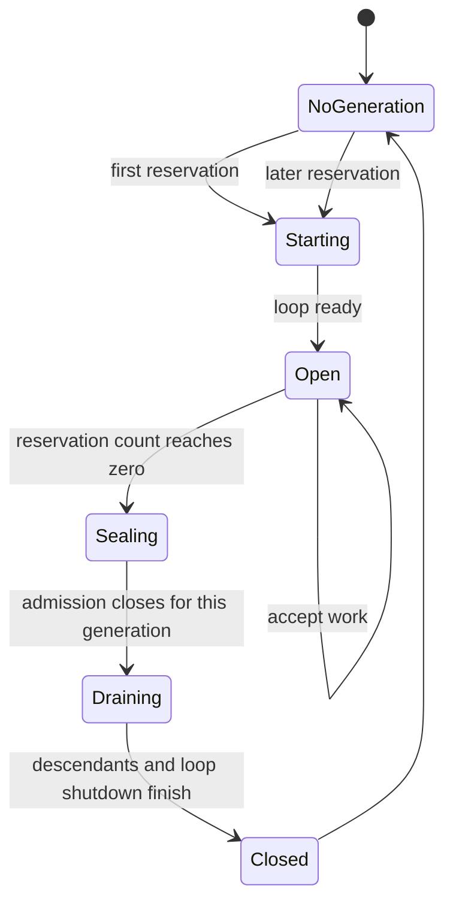
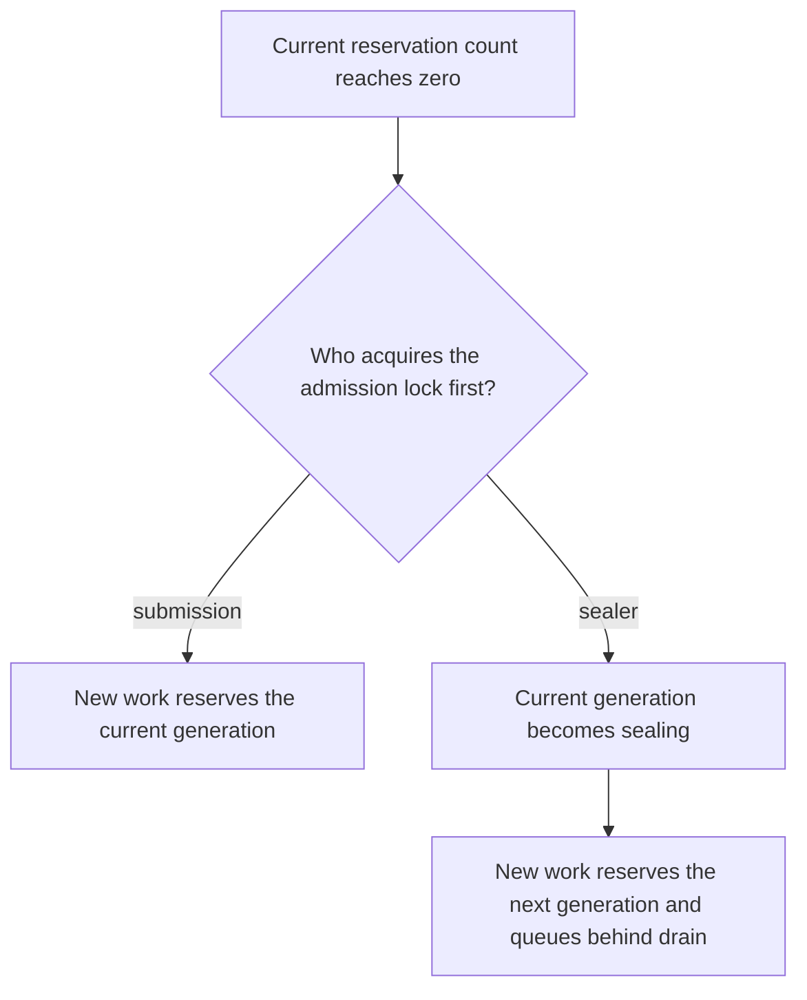
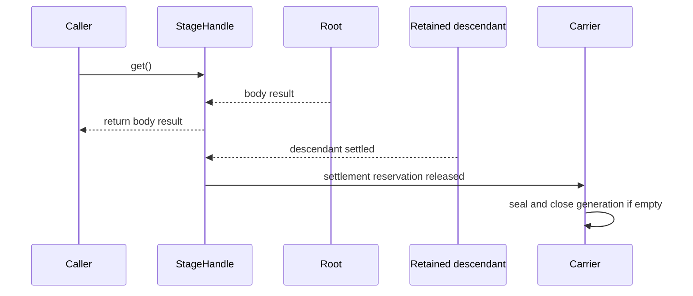

# Stage Runtime Foundation Refactor Design

Status: implemented and verified

Date: 2026-07-11

Repository: `Agently-Stage`

Branch: `refactor/stage-runtime-foundation`

Base: `origin/main` at `6959104`

Implementation anchors:

- `3054b19` — finite carrier generations, Stage scope, StageHandle, settlement;
- `4630703` — lifecycle-neutral compatibility facades;
- `83f1808` — replayable Tunnel;
- `d7bf980` — StageStream and generator settlement;
- `d55467b` — Stage-backed EventEmitter;
- the final acceptance commit containing this status, typing, docs, examples,
  package metadata, and completion evidence.

## 1. Executive Summary

Agently-Stage will remain an independent project and become the process-local
runtime foundation for safely bridging synchronous callers, asynchronous work,
stream transport, and event listeners.

The refactor replaces the current per-instance forever-loop and auxiliary
thread-pool design with:

- one lazily created process-wide control executor with at most one control
  worker;
- finite event-loop generations that open only while retained work exists;
- atomic admission and sealing, without an idle grace period;
- a strict distinction between root/body result and complete settlement;
- an explicit context-manager lease for callers that require stable loop
  affinity;
- a separate executor boundary for blocking synchronous work;
- loop-neutral scalar, stream, writable-channel, and event-listener contracts.

The project will be implemented and validated in Agently-Stage before Agently
changes any internal owner. The design nevertheless records the future Agently
replacement map up front so the independent Stage API is shaped by real
downstream contracts rather than by local convenience.

## 2. Evidence And Current-State Facts

### 2.1 Repository baseline

The isolated worktree was created from current `origin/main`. With Python
3.10.13 and the locked development dependencies:

```text
python -m pytest -q
22 passed in 24.57s
```

The current tests prove existing public examples but do not prove safe
interpreter shutdown, autonomous loop reclamation, result-versus-settlement
separation, generation-boundary admission, or avoidance of daemon bridge
threads.

### 2.2 Current implementation risks

The current implementation has multiple lifecycle owners:

- every non-reused `StageDispatchEnvironment` creates a new non-daemon loop
  thread and a new default executor;
- `auto_close_checker()` performs `threading.Event.wait()` inside the event-loop
  thread and can block coroutine progress;
- `StageDispatch.close()` submits shutdown through a separate
  `TaskThreadPool`, so scope close is not itself the settlement barrier;
- callbacks and finalizers have historically been scheduled separately from
  the body-result signal;
- `Tunnel` creates a Stage-backed generator inside a context and returns the
  generator outside that context;
- `EventEmitter.emit()` creates a Stage context per emit and returns listener
  handles after that context has begun closing;
- generator and callback paths use polling, blocking events, or extra threads
  that do not share one explicit process owner.

### 2.3 Agently downstream evidence

Agently's current `FunctionShifter` demonstrates the required future consumer
contract:

- `syncify()` calls `asyncio.run()` for every ordinary synchronous call;
- when invoked while the caller already has a running loop, `syncify()` creates
  and joins a new thread for each call;
- `future()` tries to retain a daemon event-loop thread, but assigns the return
  value of `thread.start()` (`None`) as the thread field;
- sync/async generator adapters create daemon bridge threads;
- a root coroutine returning through `asyncio.run()` causes remaining
  unretained tasks to be cancelled during runner shutdown.

Stage must therefore prove autonomous creation, result delivery, retained
descendant completion, and generation shutdown before FunctionShifter can
delegate to it.

### 2.4 Topology performance proof

A local topology experiment on Python 3.10.13 observed:

| Case | Observed median |
|---|---:|
| 100 native asyncio tasks, each sleeping 20 ms | 22.28 ms |
| 100 tasks on one loop hosted by one control worker | 23.61 ms |
| The same tasks incorrectly run as serial one-worker pool jobs | 2.18 s |
| 3,000 native no-op tasks | 16.1 ms |
| 3,000 individually cross-thread-submitted no-op tasks | 70.0 ms |
| 1,000 empty `asyncio.run()` generations | 207.6 ms total |

The evidence shows that a single control worker does not remove coroutine
concurrency. The dangerous implementation is using that worker as the task
executor. Cross-thread root submission and generation creation are measurable
for microtasks, so the architecture must keep coroutine descendants inside the
Stage loop and provide explicit scope pinning for tight task bursts.

## 3. Goals

1. Make ordinary synchronous scripts safe without requiring a public shutdown
   hook.
2. Let a caller receive the root/body result before retained background work
   has completely settled.
3. Keep the process alive while Stage-owned retained work exists, then reclaim
   the event-loop generation without user `atexit` logic.
4. Preserve native asyncio concurrency within one generation.
5. Support calls made both with and without a running user event loop without
   reusing or mutating that user loop.
6. Keep one clear process owner for cross-thread coroutine transport.
7. Preserve `Tunnel` as an independently writable public channel.
8. Introduce `StageStream` as the task-bound, read-only stream result.
9. Rebuild `EventEmitter` on Stage settlement rather than on per-emit temporary
   dispatch environments.
10. Provide enough loop-neutral contracts for Agently to replace hidden loop,
    daemon bridge, background drain, and listener-dispatch mechanisms later.

## 4. Non-Goals

- Stage does not own workflow orchestration, DAG scheduling, retries,
  approvals, pause/resume, or business completion policy.
- Stage does not replace TriggerFlow SignalNet or `when(...)` semantics.
- Stage does not own RuntimeEvent schemas, EventCenter matching, coalescing,
  delivery policy, or DevTools projection.
- Stage does not own model-provider remote cancellation or `abort()` policy.
- Stage does not infer business success from task cancellation.
- Stage does not make sequential synchronous calls concurrent automatically.
- Stage does not retain tasks created on unrelated loops or threads.
- Stage does not provide a production distributed executor.
- The first refactor does not add bounded replay, distributed channels, or
  durable persistence to Tunnel.

## 5. Alternatives Considered

### 5.1 One permanent daemon loop thread

This minimizes loop creation cost but recreates the original shutdown problem.
Daemon termination can interrupt finalizers and provider drains, and user
`atexit` handlers cannot safely assume an asyncio loop can still be awakened.

Rejected.

### 5.2 One new thread and loop per call

This makes each call easy to reason about but repeats thread creation, loses
cross-call batching, and makes `FunctionShifter.syncify()` expensive when used
frequently.

Rejected.

### 5.3 One control worker with finite loop generations

One process-wide control executor hosts at most one event-loop generation at a
time. Each generation accepts concurrent asyncio tasks, drains retained work,
closes its loop, and returns control to the worker. Later work creates a new
generation on the same control executor.

Accepted.

## 6. Target Architecture

### 6.1 Layered modules



The public layer never exposes loop objects, threads, locks, interpreter hooks,
or executor shutdown mechanics. Carrier and generation types are private.

### 6.2 Component ownership

| Component | Owns | Does not own |
|---|---|---|
| `Stage` | A logical submission scope, optional context lease, and scope close barrier | A private event loop or thread per instance |
| `StageHandle[T]` | Root/body result, settlement, descendants, callbacks, cancellation handoff | Business abort or recovery policy |
| `Tunnel[T]` | Writable ordered channel, replay history, subscriber cursors, EOF/failure | Task execution or business event semantics |
| `StageStream[T]` | Read-only task-bound stream view plus source settlement | External writes or a second channel implementation |
| `EventEmitter` | Listener registry, once semantics, fan-out handles, emitter settlement | RuntimeEvent policy or workflow signals |
| private carrier | Admission, generation creation/seal/drain, loop ownership | User-facing policy |
| blocking executor | Sync callable execution | Asyncio loop control |

### 6.3 Terminology overlap audit

The Agently concept registry, naming conventions, and current glossary surfaces
were checked because Stage is intended to become a downstream foundation.

| Proposed term | Nearest existing term | Why the existing term is insufficient | Overlap guard |
|---|---|---|---|
| `StageHandle` | `StageResponse` | StageResponse exposes the body response but not the distinct descendant, callback, finalizer, and cancellation settlement contract | StageResponse remains a compatibility facade; only StageHandle owns Stage task lifecycle observation |
| `StageStream` | `StageHybridGenerator`, Agently execution stream | StageHybridGenerator mixes task execution, generator bridging, polling, and per-item callback behavior; an Agently execution stream is a business/runtime-event projection | StageStream is only a read-only task-bound value stream and does not define Agently stream-item semantics |
| generation | Event-loop environment, TriggerFlow execution | The refactor needs a private name for one finite carrier-loop lifecycle; neither a workflow run nor a public runtime environment has that meaning | Generation stays private and diagnostic; it is never a user execution owner |
| settlement | body result, TriggerFlow execution close | Body completion can precede retained descendants and callbacks; TriggerFlow close includes workflow policy outside Stage | Settlement reports only Stage-owned work quiescence and never business success |
| carrier | runtime, dispatch environment | `runtime` and `execution` already identify public Agently owners, while the current dispatch environment leaks loop mechanics | Carrier is a private mechanism name and is not exported as a manager or facade |

`Tunnel`, `EventEmitter`, and `Stage` retain their existing project meanings.
The design does not introduce another RuntimeEvent, SignalNet, EventCenter,
ModelRequestResult, TriggerFlowExecution, or business task abstraction.

## 7. Carrier And Generation Lifecycle

### 7.1 Definition

A generation is one finite lifecycle of an asyncio event loop on the shared
control worker. It is not one call, one business stage, or one OS thread.



One process can execute generation 1, close it, remain without a running loop,
then execute generation 2 on the same control executor.

### 7.2 Atomic admission and sealing

Submission and zero-reservation sealing use the same admission lock.



There is no correctness grace period:

- if submission wins, the current generation remains open;
- if sealing wins, later submission is accepted into the next generation;
- the next generation may be reserved before the current generation finishes
  draining, but only one loop is active at a time;
- submission is not rejected merely because it arrived at an empty boundary.

### 7.3 Retained work

Generation reservations include:

- Stage-submitted root tasks;
- asyncio tasks created as descendants while a Stage-owned execution context is
  active;
- callback and finalizer tasks;
- StageStream source consumption;
- Tunnel and EventEmitter delivery work explicitly attached to the generation;
- scope leases held by active pinned contexts.

Tasks on unrelated event loops, threads, or external systems are not retained.

The Stage loop installs a private task factory or equivalent context-aware task
registration so `asyncio.create_task()` inside Stage-owned work is not silently
cancelled when the root coroutine returns.

### 7.4 Drain sequence

After seal, the generation:

1. stops accepting work into that generation;
2. waits for all retained descendants and settlement callbacks;
3. finishes async generators;
4. finishes Stage-owned loop shutdown work;
5. closes the asyncio loop on its owner thread;
6. completes the control job;
7. starts an already-reserved next generation, if any.

No asynchronous work is first scheduled from a user `atexit` handler.

### 7.5 Process exit

- The control worker is non-daemon.
- If a generation is active, normal interpreter shutdown waits while that
  already-running generation continues processing.
- When no generation is active, no asyncio loop needs to be awakened.
- The process-wide ThreadPoolExecutor uses Python's own executor thread-exit
  coordination to wake and join its idle worker; Stage does not use that phase
  to schedule loop work.
- No public `shutdown()` API is required for ordinary scripts.

## 8. Stage Scope And Context Semantics

### 8.1 Plain Stage scope

Creating `Stage()` creates no thread and no loop. A plain Stage instance is an
unpinned logical scope:

- each `go()` call reserves the currently open generation or the next one;
- an idle generation may close while the Stage object remains usable;
- later calls through the same Stage instance may run in a later generation;
- generation identity is diagnostic and cannot affect result semantics.

### 8.2 Pinned context scope

Entering `with Stage()` or `async with Stage()` makes the scope pinned. Its
first submission obtains a generation lease that remains until context close.

```python
with Stage() as stage:
    client = stage.get(create_loop_bound_client)
    result = stage.get(use_loop_bound_client, client)
```

Both calls run on the same generation even if no task is active between them.
This permits safe reuse of loop-affine resources.

Leaving the context:

- seals that Stage scope against new submissions;
- releases its generation lease;
- waits for all handles owned by that scope to settle;
- does not wait for unrelated scopes sharing the carrier;
- does not close a generation still reserved by another scope.

An empty context creates no loop.

### 8.3 Explicit close

`Stage.close()` and `Stage.async_close()` are real scope settlement barriers.
They are useful for explicit application scopes but are not required by
FunctionShifter-style implicit calls or ordinary one-shot scripts.

## 9. Root Result Versus Settlement

The root/body outcome and full settlement are separate completion channels:

- the body outcome is a one-shot future;
- settlement is a scope-aware quiescence barrier, not a second one-shot future.



`StageHandle[T]` provides:

```python
result = handle.get(timeout=None)
result = await handle.async_get(timeout=None)

handle.wait_settled(timeout=None)
await handle.async_wait_settled(timeout=None)
```

Rules:

- `get()` and `async_get()` return or raise the root/body outcome;
- they do not wait for retained background descendants unless the body itself
  awaits them;
- settlement waits include descendants, callbacks, and finalizers;
- while a scope remains open, admitting a new callback against a cached body
  outcome may move the handle from quiescent back to unsettled;
- `wait_settled()` atomically observes the work admitted before its barrier and
  waits for that work plus all of its transitively retained descendants; later
  independent legal admission belongs to a later barrier;
- Stage scope close waits settlement;
- Stage scope close atomically rejects later admission before waiting, so its
  final settlement cannot reopen;
- an active non-daemon generation keeps an ending script alive after body
  result delivery;
- arbitrary external work is not converted into a Stage descendant.

This contract directly supports ModelRequest-style early business return plus
background provider drain later, without placing ModelRequest policy in Stage.

## 10. Callback Contract

The canonical callback surface is chainable on the handle:

```python
handle = (
    stage.go(task)
    .on_success(success_handler)
    .on_error(error_handler)
    .on_finally(finalizer)
)
```

Rules:

- each registration returns the same handle;
- multiple matching handlers run in registration order;
- success handlers observe the original body result;
- error handlers observe the original body exception;
- error handlers do not recover or replace the body result;
- finalizers run after the selected success/error observers;
- callback failures are settlement failures and do not rewrite the body
  outcome;
- finalizers still run after earlier callback failure;
- late registration before scope seal observes a cached completed outcome and
  may reserve the current or next generation;
- registration after scope seal fails fast;
- callbacks may be synchronous or asynchronous;
- callback-created Stage descendants retain settlement.

Callback registration, scope sealing, and settlement-barrier creation use one
scope admission lock. Therefore an immediately completing body cannot make
`stage.go(task).on_success(...).on_finally(...)` fail nondeterministically. No
timing grace period is used to keep the chain open.

Python cannot parse `.finally()`, so `.on_finally()` is canonical. The new
recommended API does not add a duplicate `.finally_()` alias.

Legacy `go(..., on_success=..., on_error=..., on_finally=...)` parameters may
delegate to the same registration path as compatibility input, but new examples
use the handle chain.

## 11. Async Concurrency And Blocking Work

### 11.1 Control worker is not a task worker

The process-wide `ThreadPoolExecutor(max_workers=1)` runs the event-loop
generation controller. Async callables become asyncio tasks on that loop and
remain concurrent.

It is forbidden to run each coroutine as a separate executor job with
`asyncio.run()`.

### 11.2 Separate blocking executor

Synchronous callables and synchronous generator stepping run on a separate
blocking executor. The control executor must never be installed as the loop's
default executor.

The legacy `max_workers` option, if retained for compatibility, configures only
a scope-private blocking executor. Without it, Stage uses a shared blocking
executor. Closing a scope shuts down only its private executor after its work
settles.

### 11.3 Loop-thread blocking prohibitions

The event-loop thread must not execute:

- `threading.Event.wait()`;
- `concurrent.futures.Future.result()`;
- blocking `queue.Queue.get()`;
- `time.sleep()`;
- synchronous listener or callback bodies;
- blocking executor shutdown.

Loop-facing waits use asyncio primitives or non-blocking handoff.

### 11.4 Performance posture

- Async services should use async APIs directly; sync bridges are outer
  compatibility boundaries.
- Many fine-grained tasks should be created inside one Stage root or pinned
  context rather than cross-thread-submitted individually.
- Generation creation has a fixed cost and is not intended as a per-token
  primitive.
- CPU-bound work gains no concurrency from asyncio and must use the blocking
  executor or another application-owned process boundary.

## 12. Tunnel Contract

`Tunnel[T]` remains a public, independently writable transport. It is not
renamed to StageStream.

Conceptual API:

```python
tunnel = Tunnel[T](timeout=None)
tunnel.put(item)
await tunnel.async_put(item)
tunnel.close()
await tunnel.async_close()

for item in tunnel:
    ...

async for item in tunnel:
    ...

items = tunnel.get(timeout=None)
```

Rules:

- multiple threads or coroutines may produce values;
- accepted values have one total publication order;
- every subscriber has an independent cursor and receives the accepted
  sequence;
- late subscribers replay accepted history, preserving existing public
  behavior and supporting StageStream readers;
- the channel publishes exactly one logical EOF;
- `close()` is idempotent;
- `fail(error)` publishes terminal failure to all subscribers;
- values accepted before close/failure remain readable;
- writes after terminal state fail deterministically;
- sync and async consumers use condition/handoff mechanisms, not polling
  threads;
- consumer timeout ends that wait and does not silently mutate channel state;
- full finite history is retained until the Tunnel is released.

`put_stop()` remains a compatibility alias for `close()` during the preview
migration. New documentation uses `close()`.

Tunnel owns transport only. It does not match events, schedule workflow nodes,
or decide whether a model result is complete.

## 13. StageStream Contract

`StageStream[T]` is the read-only task-bound stream returned when Stage runs a
sync or async generator.

It composes:

- a read-only Tunnel view for items, replay, EOF, and source errors;
- StageHandle settlement for source execution, descendants, cancellation, and
  finalization.

Conceptual API:

```python
stream = stage.go(generator_function, *args)

for item in stream:
    ...

async for item in stream:
    ...

items = stream.get(timeout=None)
await stream.async_wait_settled(timeout=None)
```

External callers cannot write into a StageStream. The source begins eagerly by
default; `lazy=True` is a compatibility option that starts consumption on the
first reader.

StageStream settlement callbacks run once for the source task. Legacy
StageHybridGenerator per-item transformation callbacks remain in a
compatibility facade and are not the canonical StageStream callback meaning.
New code transforms items in explicit iterators or application-owned stream
adapters.

The useful StageHybridGenerator name remains importable as a preview
compatibility facade over StageStream while migration guidance points to
StageStream.

## 14. EventEmitter Contract

EventEmitter remains a public generic process-local event dispatcher.

It owns:

- thread-safe `on`, `off`, and `once` registration;
- listener snapshotting at emit time;
- sync and async listener normalization through Stage;
- fan-out result handles;
- once-listener removal before invocation, preventing concurrent double-fire;
- pending-listener settlement and explicit emitter close.

Conceptual API:

```python
emitter.on("event", listener)
emitter.once("event", once_listener)

handles = emitter.emit("event", payload, wait=False)
await emitter.async_emit("event", payload, wait=True)

emitter.close()
await emitter.async_close()
```

`wait=False` returns immediately with handles while Stage retains listener work.
`wait=True` waits for listener body results and settlement. Closing the emitter
prevents new emits and waits for pending listener settlement.

EventEmitter does not own RuntimeEvent envelopes, delivery-policy buffering,
summary reduction, workflow signal gates, or durable event storage.

## 15. Error And Cancellation Semantics

- Body exceptions are re-raised by result readers.
- Stream source exceptions are delivered to every subscriber and settlement
  reader.
- Tunnel terminal failure is delivered after already-accepted items.
- Callback/finalizer failures are reported by settlement readers and Stage
  close without rewriting the body outcome.
- Listener failures are isolated per listener and remain available through the
  returned handle.
- `cancel()` requests cancellation on the owner loop and waits for task
  acknowledgement; it is not business abort.
- Stage lifecycle failures use typed errors rather than interpreter-shutdown
  warning strings.
- Expected Stage-managed cancellation and ordinary generation close do not emit
  warnings by default.
- Unobserved failure collection is diagnostic; it does not raise arbitrary
  exceptions on the owner loop after the caller has returned.

## 16. Existing Module Repositioning

| Current module | Target position |
|---|---|
| `Stage.py` | Public logical scope over the private carrier |
| `StageDispatch.py` | Replaced by private carrier/generation implementation; compatibility imports may delegate during the preview line |
| `StageTask.py` | Folded into private task/descendant registration and StageHandle settlement |
| `StageResponse.py` | Replaced by StageHandle; import retained as a preview compatibility facade |
| `StageHybridGenerator.py` | Replaced by StageStream; import retained as a preview compatibility facade |
| `Tunnel.py` | Retained and rewritten as the writable transport primitive |
| `EventEmitter.py` | Retained and rewritten on Stage settlement |
| `TaskThreadPool.py` | Removed as an independent lifecycle owner; compatibility import must not create another global pool |
| `StageFunction.py` | Retained as a compatibility convenience over Stage.go, not a carrier owner |
| `Events.py` | Retained outside the carrier core for compatibility; it must not participate in generation shutdown |
| `StageException.py` | Replaced or expanded into typed body, settlement, lifecycle, channel, and closed-scope errors |

Compatibility facades protect the already published preview package, but the
new architecture does not preserve undocumented intermediate implementation
mechanics such as `reuse_env` or per-instance loop ownership.

## 17. Future Agently Replacement Map

Agently-Stage has no dependency on Agently. The following table is a design
input and future integration plan, not work performed in this repository.

| Agently owner/current mechanism | Future Stage use | Semantics that remain with Agently |
|---|---|---|
| `FunctionShifter.syncify` | Thin wrapper over Stage submission and body-result read | Existing sync API shape and caller-level blocking semantics |
| `FunctionShifter.future` | StageHandle/future projection instead of daemon loop | Compatibility return typing |
| generator conversion helpers | StageStream/Tunnel instead of daemon bridge threads | Existing public generator reader shapes |
| `GeneratorConsumer` | Compatibility facade over StageStream replay/fan-out | Consumer API and owner-specific stream types |
| ModelRequest transport drain | Retained Stage descendant after business result freezes | Business satisfaction, result freezing, provider abort, usage/meta, RuntimeEvents |
| Action Flow active completion | Reuse ModelRequest/Stage drain path | Tool/action success and orchestration decision |
| EventCenter listener invocation | EventEmitter/Stage for generic handler execution and pending settlement | RuntimeEvent normalization, matching, summary buffering, delivery policy, flush, DevTools |
| TriggerFlow sync bridge | Stage through FunctionShifter compatibility | Execution lifecycle and state |
| TriggerFlow runtime stream bridge | StageStream/Tunnel through GeneratorConsumer | Stream item business contract and execution close |
| TriggerFlow `emit_nowait` internal tasks | No replacement by default | SignalNet, context, layer, concurrency, pending-task ownership |
| TriggerFlow `when(...)` | No replacement | Signal matching, AND/OR gates, aggregation, graph export, recovery |
| FastAPI/SSE readers | Indirect StageStream bridge | HTTP/SSE protocol and application event shaping |
| provider `abort()` | No replacement; Stage only retains drain | Provider-specific remote cancellation and drain-only degradation |

Integration proceeds owner by owner only after standalone Stage acceptance.
Passing Stage tests does not authorize wholesale Agently replacement.

## 18. Testing Strategy

Implementation follows test-first development. Each behavior receives a failing
test before production code.

### 18.1 Generation lifecycle

- first submission lazily creates one generation;
- overlapping submissions share an open generation;
- zero reservations cause immediate atomic seal without grace sleep;
- submission racing with seal is accepted into current or next generation;
- already-reserved next generation starts after the previous loop closes;
- repeated batches create monotonically distinct generations;
- at most one control worker and one active loop exist;
- no daemon control or bridge thread exists;
- no loop remains active while the carrier is idle;
- an empty pinned context creates no loop.

### 18.2 Scope and affinity

- plain Stage scopes can cross generations;
- pinned contexts keep one generation across idle gaps;
- loop-bound resources remain usable inside one pinned context;
- context close rejects new scope submissions and waits its settlement;
- one scope closing does not wait unrelated scopes;
- another scope lease keeps the shared generation alive.

### 18.3 Result and settlement

- root result returns before a retained child completes;
- the process stays alive until the child settles;
- settlement readers wait callbacks and finalizers;
- an immediately completing body still accepts an immediate callback chain
  without a timing grace period;
- callback admission after one generation closes reopens handle settlement in
  the next generation while the scope remains open;
- scope close racing with callback registration deterministically admits the
  callback before the final barrier or rejects it after scope seal;
- body failures and settlement failures remain distinct;
- root cancellation does not masquerade as business abort;
- descendants created with `asyncio.create_task()` are retained under the
  Stage execution context.

### 18.4 Async concurrency and performance safety

- 100 sleeping coroutines complete concurrently rather than serially;
- control and blocking executors use different workers;
- synchronous work does not block the loop heartbeat;
- cross-thread submission overhead and generation creation cost are recorded as
  benchmarks rather than hidden;
- one root spawning many child tasks is compared with many cross-thread root
  submissions;
- repeated `FunctionShifter.syncify`-shaped calls do not create one thread per
  call.

### 18.5 Tunnel and StageStream

- concurrent producers preserve accepted publication order;
- every sync/async subscriber receives the full sequence;
- late subscribers replay history;
- EOF and failure are delivered exactly once per subscriber;
- writes after close/failure fail deterministically;
- no polling or daemon bridge thread is created;
- StageStream is externally read-only and source-loop-safe;
- source cancellation and errors reach all readers.

### 18.6 EventEmitter

- concurrent emit cannot invoke a once listener twice;
- sync and async listeners run without blocking the Stage loop;
- `wait=False` returns handles before listener completion;
- emitter close drains registered pending listener work;
- listener failure is isolated and observable;
- no temporary Stage environment is created per emit.

### 18.7 Script subprocess tests

Subprocess tests are mandatory because in-process pytest cannot prove
interpreter exit behavior:

- a no-work script exits immediately;
- a script with a retained background child waits for that child;
- the child completes without interpreter-shutdown warnings;
- multiple generations finish and the script exits;
- user `asyncio.run()` remains usable before and after Stage calls;
- no user shutdown hook is called;
- pending work is not awakened for the first time from `atexit`.

## 19. Delivery Phases

### Phase 1: carrier and scalar handle

Land the private carrier, finite generations, Stage scope, StageHandle,
result-versus-settlement, context leases, typed errors, and subprocess lifecycle
tests.

### Phase 2: blocking work and callback settlement

Add the separate blocking executor, sync callable support, structured
descendant tracking, callback chains, and compatibility StageResponse behavior.

### Phase 3: Tunnel and StageStream

Rewrite Tunnel, add StageStream, migrate generator execution, and retain the
StageHybridGenerator compatibility facade.

### Phase 4: EventEmitter

Rebuild EventEmitter on Stage handles and settlement, including concurrent once
semantics and emitter close.

### Phase 5: standalone acceptance and release decision

Run the full Python 3.10+ matrix, benchmarks, stress tests, subprocess exit
tests, README examples, typing checks, lint, and package installation smoke.
Decide preview compatibility and release metadata only after acceptance.

### Phase 6: Agently integration planning

Return to Agently and implement the replacement map owner by owner, beginning
with FunctionShifter and generator bridges, followed by ModelRequest drain.
EventCenter and TriggerFlow changes require their own tests and owner-level
review.

## 20. Architecture Risk Review

### Recursive ownership

- EventEmitter may use Stage; Stage core must not use EventEmitter internally.
- StageStream may use Tunnel; Tunnel must not create Stage instances.
- The control worker must not submit blocking work to itself.

### Hidden loops

- Public Stage objects do not own private forever loops.
- Compatibility facades delegate to the one carrier.
- No utility may create an unregistered daemon loop or bridge thread.

### Unclear policy owner

- Stage reports task and lifecycle facts only.
- Business completion, warning level, provider abort, workflow routing, and
  RuntimeEvent policy remain with downstream owners.

### Missing evidence path

- Handles expose body result and settlement separately.
- Stream/channel terminal failures remain readable.
- Generation identity and lifecycle failures are available for diagnostics.

### Duplicated execution abstractions

- StageDispatch and TaskThreadPool cannot survive as independent runtime
  owners.
- Stage callbacks are observers, not a Promise transformation pipeline.
- EventEmitter is local pub/sub, not TriggerFlow SignalNet.

### Efficiency risks

- A single control worker must never serialize coroutine tasks.
- Fine-grained cross-thread submissions must be batchable inside a Stage root or
  pinned scope.
- Loop creation cost must remain visible in benchmarks.
- Long-lived pinned scopes intentionally trade reclamation for loop affinity.

## 21. Acceptance Criteria

The standalone refactor is accepted only when:

1. all existing tracked tests pass or have an explicitly reviewed migration;
2. new lifecycle, race, settlement, stream, emitter, and subprocess tests pass;
3. ordinary scripts require no manual shutdown call;
4. no daemon control or bridge threads remain;
5. retained background work completes before process exit;
6. idle generations close without a correctness grace period;
7. repeated batches can create and close generations indefinitely;
8. a pinned Stage context preserves loop affinity;
9. async concurrency remains demonstrably non-serial;
10. control and blocking executors are separate;
11. Tunnel remains public and writable while StageStream remains read-only and
    task-bound;
12. EventEmitter drains listener work without creating per-emit Stage
    environments;
13. public typing covers parameters, results, stream items, callbacks, errors,
    and nullable paths;
14. README and runnable examples describe the new recommended contracts;
15. the Agently replacement map remains accurate and no Agently semantic owner
    has leaked into Stage.

## 22. Implementation Acceptance Evidence

Evidence date: 2026-07-11

Environment:

- development tests: Python 3.10.13 in the isolated worktree `.venv`;
- clean installed-package smoke: Python 3.10.16 in a new repository-external
  virtual environment;
- notebook execution: clean Jupyter kernel process on Python 3.13, which is
  above the supported 3.10 floor;
- branch: `refactor/stage-runtime-foundation`;
- base: `origin/main` `6959104`.

| Criterion | Direct evidence |
|---|---|
| 1. Existing tests | `.venv/bin/python -m pytest -q` completed with 91 passed, including the retained preview tests |
| 2. New lifecycle/race/settlement/stream/emitter/subprocess coverage | `tests/test_runtime/` contains direct generation, scalar, scope, callback, compatibility, Tunnel, StageStream, EventEmitter, Events, and subprocess tests, including concurrent close barriers, self-close rejection, and atomic late-callback admission |
| 3. No ordinary-script shutdown call | `test_empty_stage_script_exits_without_shutdown_hook` and the installed-package smoke exit normally |
| 4. No daemon control or bridge threads | `test_stage_threads_are_shared_and_non_daemon`; production scan finds no raw `Thread`, daemon flag, `atexit`, `asyncio.run`, or `run_forever` |
| 5. Retained work completes before process exit | `test_process_waits_for_retained_stage_work` observes `body-finished` followed by `child-finished` without destroyed-task warnings |
| 6. Atomic idle seal without grace | `test_plain_stage_can_cross_finite_generations` and `test_next_generation_queues_while_previous_loop_drains` prove immediate seal/next admission without sleep policy |
| 7. Repeated finite generations | `test_plain_stage_can_cross_finite_generations` and `test_multiple_generations_finish_before_process_exit` prove later batches receive newer generation ids and exit |
| 8. Pinned loop affinity | `test_pinned_context_keeps_loop_affinity_across_idle_gap` proves two calls return the same loop object; `test_empty_context_creates_no_generation` proves lazy leasing |
| 9. Async concurrency remains non-serial | `test_coroutines_remain_concurrent_on_single_control_worker` plus the retained benchmark suite |
| 10. Control and blocking executors are separate | `test_blocking_executor_does_not_block_stage_loop` observes `AgentlyStageBlocking` and `AgentlyStageControl` threads while the heartbeat completes before blocking release |
| 11. Tunnel writable; StageStream read-only | Tunnel replay/fan-out/race tests and `test_sync_generator_returns_read_only_replayable_stage_stream` |
| 12. EventEmitter drains without per-emit Stage environments | EventEmitter race tests cover concurrent once, immediate return, close drain, async wait, error isolation, and closed admission |
| 13. Public typing complete | `.venv/bin/pyright agently_stage tests examples` reports 0 errors/0 warnings; installed-package `--verifytypes agently_stage --ignoreexternal` reports 179/179 known symbols and 100% completeness; wheel contains `py.typed` |
| 14. README and runnable examples | `examples/runtime_foundation.py` produces the four recorded key-output lines; `jupyter nbconvert --execute` executes `examples/readme_examples.ipynb` without warnings |
| 15. Owner boundaries preserved | `pyproject.toml` has no runtime dependency on Agently; production code contains no EventCenter, RuntimeEvent, TriggerFlow, provider abort, or business-completion owner; Section 17 retains the owner-by-owner future integration map |

Additional verification:

```text
.venv/bin/pre-commit run --all-files
all hooks passed

clean installed-package smoke
installed-smoke=ok
```
